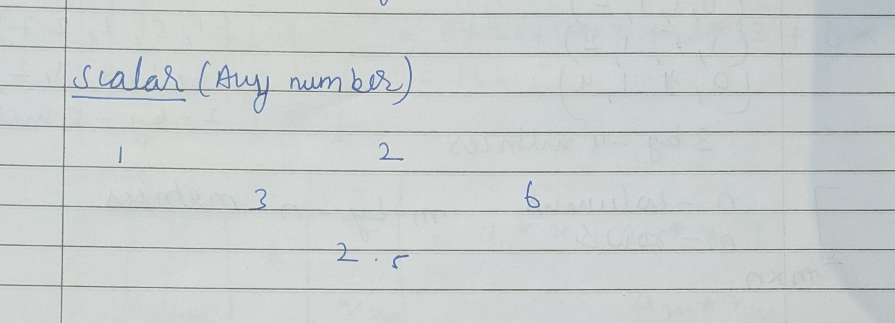
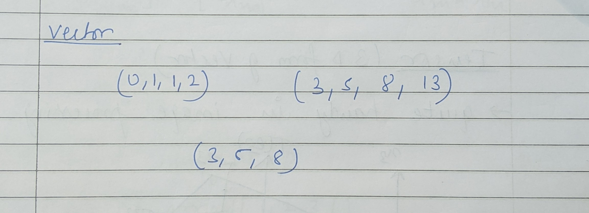
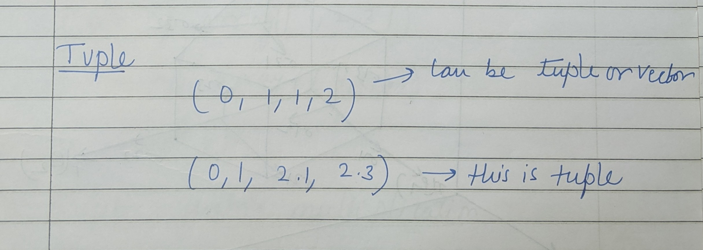
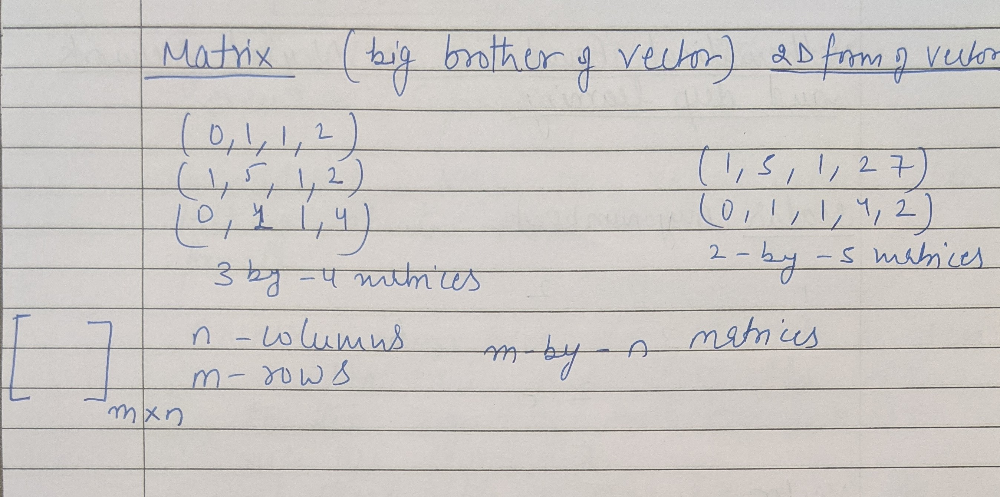
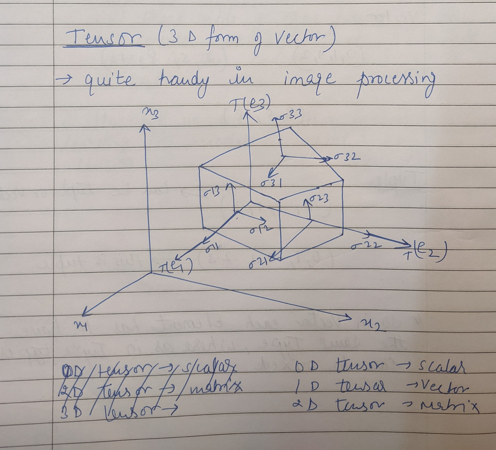
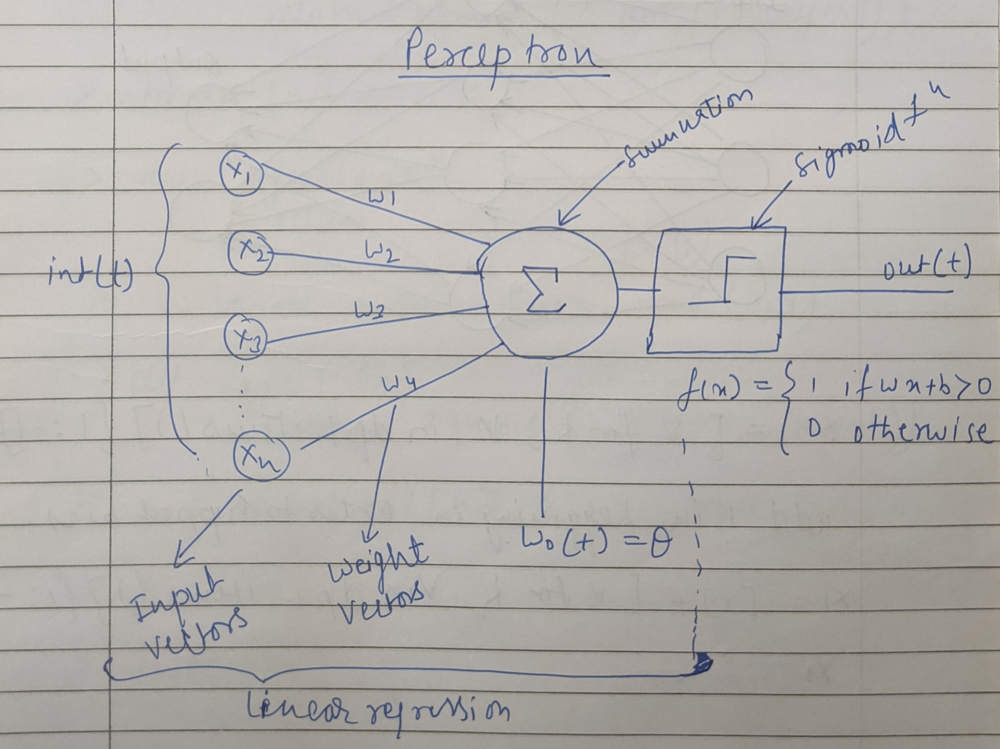

 Deep learning is a technique which 

## Scaler 

Any single whole number can be represented as scalar quantity 

## Vector
- A quantity having both direction and magnitude,
- You can think it as a arrow having certain length pointing toward certain direction
- It is also called as a directional line segment 
- Vectors are the wider class of tensors which we talk about later on

### Types of vector
- Zero vector : Quantity which do not have any direction as well as magnitude
- Unit vector : It always gives a direction of a vector having magnitude 1 unit, it has a direction pointing toward the axis(x-axis,y-axis,z-axis) of the cartesian plan
- Co-initial vector : vector having same initial points
- Collinear / parallel vector : vector having same/parallel line of support
- Co-planar vector : Two or more vector lynig on the same plane
- Negative vector : vector having same magnitude but in opposit direction
- Equal vector : vectors having equal maginitude and equal direction 
Two vector having same length and are parallel two each other called as equal vector doesn't matter in which plane they are 
## Tuple
- The only difference between a Tuple and a Vector is in the quantity a tuple can have different type of data type but vector contain only one type of data type

## Matrix
A matrix is a 2-d vector 

## Tensor
- 0-D Tensor called scaler
- 1-D Tensor called vector
- 2-D Tensor called matrix
ans so on...

The fact of the universe : All observer in all reference frame agree. Not on the basis vector not on the component, But on the combinations of component and basis vectors.
The reason for that is that the basis vector transform one way between reference frames and the components transform in such a way so as to keep the components and basis vectors the same for all observers

It was this characterstics of tensors that caused Lillian Lieber to call Tensors "The Facts of the universe"

# Perceptron

- The Idea is that your input vectors(x1,x2,x3...) gets multiplied with your weights(w1,w2,w3..) vectors
- It is nothing but Linear combination or dot product of the two vectors or in other or in other words, linear regression.
- And it is passed through a activation function (sigmoid, Tanh, reLu etc.) and you done you have a perceptron.
- It is the simplest neural network
