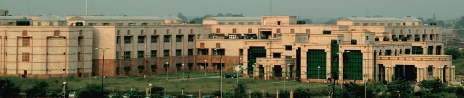

## How it all started?

I came across the post on internshala, opening for data science Intern in [ CSIR-CDRI](https://cdri.res.in/) where we will be working directly under the senior data scientist, just finished the my data science course so I was very eager to apply my learnings on the wide project.  
For acceptance accessment they give me task to scrap the data from different website, to test my ability for the intership

## Learnings from the experience

As part of my internship, I worked on the CNN neural Networks, Performed denoising with the help of autoencoders with LSTM layers and segmentation with double-Unet for the project of prediction and classification of pancreatic cancer of dicom images. Apart from that, our team has converted dicom images into png files.

Apart from the technical skills, working together as a team on a particular project has really improved by soft skills as I was able to:

* Communicate my ideas in clear terms with my team
* Collaborate with the team to uncover creative ideas and share different perspectives and experiences on tasks
* Apply the concepts learnt to find answers to problems and formulate workable solutions
* Accommodate my team’s needs as the Query Analyst by relaying queries from my team to Hamoye.

The open-source projects did not only improve my skill set, but also served as a demo for real world job experience.

## After internship status

At present, I am contributing in the organisation as a Technical Team Member, building an ecosystem in which we are trying to shift the work of organisation to an open source platform so that others maintainers/contributors/projects around the world can also collaborate on a large scale.