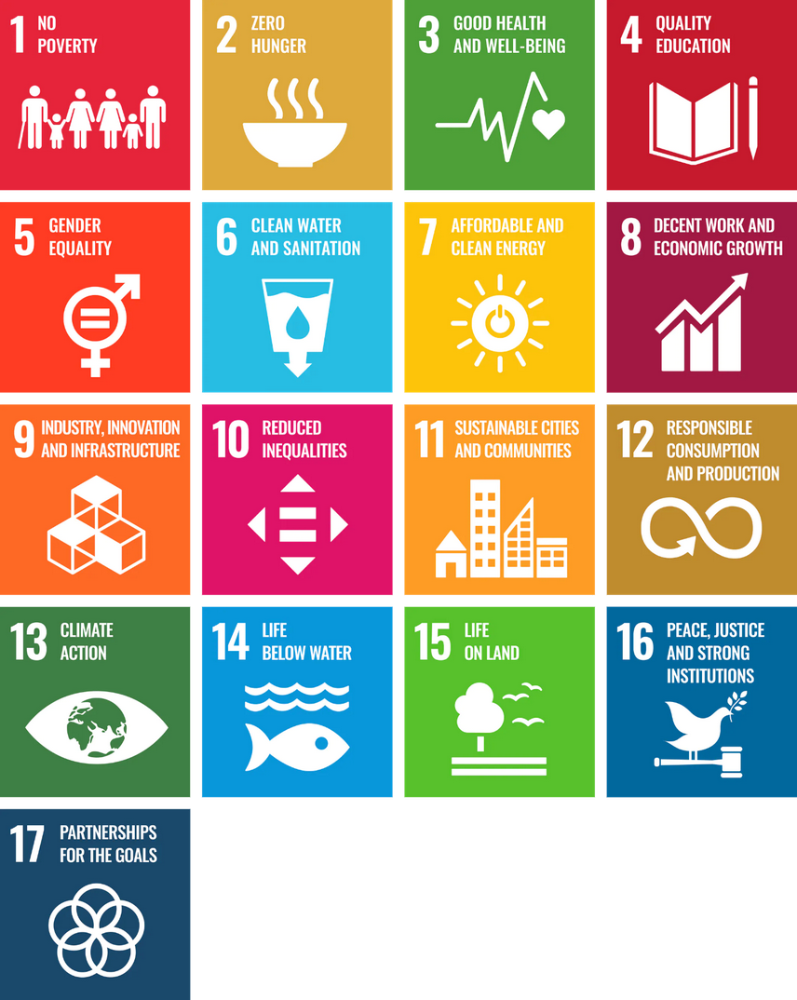

The 2021 Solution Challenge mission is to solve for one or more of the United Nations 17
Sustainable Development Goals using Google technology.

## Solution Name
HungryHome 

## Targeted UN Goals
- Goal 1: No Poverty
- Goal 2: Zero Hunger
- Goal 3: Good Health & Wellbeing
- Goal 4: Quality Education
- Goal 5: Gender Equality and Women’s Empowerment
- Goal 9: Industry, Innovation, & Infrastructure
## Technology Used in 
- Firebase
- Google Cloud Platform
- React JS
- Google Maps

## YouTube Demo Link
https://youtu.be/e6UGMf8Wi_0

## The challenges we are trying to solve
- We are Building an ecosystem where we do not have to sleep at night without  food.

- The fact that over one-sixth of India is permanently hungry and malnourished feels troublesome. That is almost 190 million people who go to sleep hungry, on most days. Over one-third of the children under the age of five, show the prevalence of stunting.

- Most  people in India eat food from local restaurants or from DHABAs which are mostly unhealthy for which they tend to pay a lot more than any home cooked meal.

- High food Inflation in India is forcing families to choose between good meals and education.

- More than 18% of women in India are unemployed. So by this Project every Indian housewife can generate a small amount of income .
 
## Our future plans
We are Planning to build a separate application for our newbie entrepreneurs so that they can directly register there and  add food they can manage to prepare to the menu. Then they can put minimal amount(there will be limit to the cost of food on menu) or they can put up the food for free on our app, so the volunteers could pick it from there and distribute to the people who need it.
This is the YouTube video link of  design of our future work and we are working on it :

https://youtu.be/5Vwa1qGtCMs

Once this Application get ready,
We will connnect this application to the current HungryHome through APIs  and will render the available food data to our current application google map 
And we will launch this product in the common people

After that We will form a team of volunteers  working as 
a groups to encourage different household to make extra food and register in the web app. We are also planning for regular campaign in each city by Organizing different events related to hunger, health and women employment to point out these issue on larger scale .
We will also teach the working of the application to each user so that they will not face any difficulty.

## Feedback points we received from people of our solution
We have not tested our solution with the real audience because as of now this app still need time to come run but,
we took a survey in  which we targeted three kind of audience, and we talked them and understand the problems and, I have also showed them our product. 
1. Migrated people / marginalize /people of economic weaker section
2. Company employees
3. Students
* Migrated people are much concern about food cost and they have appreciated a lot of our effort  they are like something is happening good.
* Company employees are very happy to see that if this solution work they do not need to order food from restaurant. 
* Student are so much annoyed with hostel food they want a good home-made food 
and now they  can get food from home with less or even for free.
 
# Architecture
Technical components - Backend, Frontend, Technologies, Programming languages and Tools used.
Description of architecture of our solution:
We have taken care of the designing of this solution that  a person should place order in minimum number of clicks into the web application, We are trying to build the  best user interface for the local community .
We have integrated everything on google map. when a person open the application he will be redirect to its current location.
He will be able to see in which house food is available on the google map,  he can just click  on the house location(specific latitude and longitude) to get food list and he can directly order from there.
In all the process of ordering the food they do not have to go any other page they can add remove item and request food in the google map.
 
# High-level components of our architecture:
We have used react router, google-map, google sign ins, firebase high-level component etc.

React router used to manage the routes of web application. it managed all routes on every click.
Reach router used for sign-in page because it is highly efficient router in the market.

Google map is responsible for ordering food near your locations(specific latitude and longitude).
Google sign -ins plugins responsible in sign in directly by google account and after sign in credential store in firebase.

Provider component which uses context API which is responsible to prevents the props drilling, it played a very vital role in all other component.
## Products and platform that we used in building this application:

>VS Code, Adobe, google cloud platform.
- Vs code for writing the efficient code.
- Adobe for initial design of UX of web application
- Google cloud for google services

In sort :
- Front End -(CSS, JavaScript, React) for designing and the functionality of the web app

- Backend (firebase) for the hosting and the database management.

- Tools ( google map , google developer cloud) for building the Application

- We have build our front-end with react JS and back-end is managed by firebase

## Challenge we faced while building the code. 
The major challenge that we have faced while building the code is to  connecting the google maps  into our react app and second challenge is to render the data from backend to the google map so the user can directly order from the google map they do not need to go anywhere else on web application