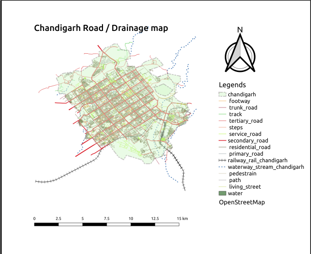

## what is the mapathon
Mapathon is map making competition for a specific problem statement. This event, organised jointly by IIT Bombay, AICTE and ISRO, will invite all Indians - to produce maps using Indian remote sensing data. The primary objective is to understand the potential of Indian remote sensing data and make maps for Indian regions using free open source mapping software (QGIS). The participants will collectively work in a crowd sourcing method for jointly producing thematic maps of India using Indian remote sensing data.
##  About the mapathon?
The data collected from Indian Space Research Organisation (ISRO) platforms have tremendous potential in mapping India’s resources, agriculture, climate and disaster management, rural and urban planning and in identifying pathways for future development. Such maps can be created using free open source platforms (such as QGIS). Let us join together to create such maps through the Mapathon and end to end innovative solutions through the Hackathon.

## our task for mapathons
Road Network / Drainage Maps
We have generated a map for the drainage pipelines and Road Network using (QGIS) open source tool link of Chandigarh City
We have generated Different kind of layers Including Base data layer, Vector data Layer, and Raster Data Layer
We have Extracted Data From Bhuvan-India geo-platform of ISRO
We have build this map for Chandigarh, India
 

## Result of our work

## Mapathons Around the world ?
[links](https://iitb-isro-aicte-mapathon.fossee.in/)
[links](https://www.agorize.com/en/challenges/heremapathon)
[links](https://mapgive.state.gov/events/)

## what are the open source softare you required to build the map ?
[QGIS](https://www.qgis.org/en/site/)
[geopanda](https://geopandas.org/)
[Geemap](https://geemap.org/)
You can also work on the maps with different python libraries apart from geopanda such as (skitlearn , matplotlib etc).

- go and check the whole project at github [link](https://github.com/sourabhsingh282/IIT-Bombay-ISRO-Mapathon)